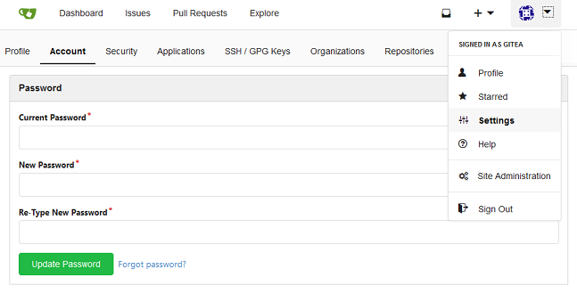

Nethserver-gitea
=====================================

**Alpha release for evaluation.**

If you have comments or remarks happy to hear them from you on the [nethserver-community](https://community.nethserver.org/) or you can raise a issue here.  
However it is considered good practice to discuss enhancements and features at the community before opening an issue.  

enjoy !  

Gitea a selfhosted code repository
-------------------------------------

Git with a cup of tea, A painless self-hosted Git service. Gitea is a community managed lightweight code hosting solution written in Go and published under the MIT license.  
Being self-hosted it is ideal for projects in an early stage of development who are not ready for publication; private projects with no public user case in general or if you are new to git/github and want to learn it in your own environment.

Installation
------------

The package and it’s dependency gitea is available in the nethforge-testing repository.

`yum install --enablerepo=nethforge-testing nethserver-gitea`

 After installation the web-ui is available at `https://FQDN_Server/git` 

The internal admin user created at first install is:

> Username: gitea  
> Password: gitea  

Change this password immediately in the web-ui at `Settings > Account > Password`  

As an alternative it is possible to add administrator rights to a (at least once logged-in) nethserver-user, this user may remove the default admin account gitea.  
`Site Administration > User Account > edit`  

>Note:  
> Gitea has an internal account for admin (among other things used for command line interaction);  
> As a consequence it is impossible to login as admin

Nethserver users must login in with the short username (omitting the `@Domain` !).  

To receive notifications users have to set their e-mail address at  
`Settings > Profile > Account > Email Address`.  

_(This is the downside of the by default configured authentication source PAM.)_  
_TODO: describe advanced configuration with bind to  Ldap/AD_

Configuration
-------------
 
 The current configuration can be reviewed with `config show gitea` , the default values after fresh installation are:

`CacheHost =` -> if a adequate host for redis is set it is used for cache instead of (empty, default) memory  
`DisableRegistration=true` -> if set to false non nethserver-users can register  
`EnableNotifyMail=true` -> notification emails are send  
`EnableOpenID=false` -> if set to true users have the option to login with openID  
`HttpAccess=public` -> if set to private web-ui and https clone are exclusively available on private networks  
`MailerEnabled=true` -> set to false to disable mailer  
`MirrorInterval=30m` -> interval to update a mirrored code repository  
`TCPPort=5321` -> listening port of gitea-service  
`VirtualHost=` -> if a FQDN is given gitea is available at `https://FQDN/`. Note clone URLs change too  
`access=localhost` -> access to gitea-service. recommended to keep this: proxy takes care of external connections  
`status=enabled` -> enable / disable gitea service  

Let's say you want to configure a VirtualHost:  
`config setprop gitea VirtualHost git.example.com`

To be able to clone/push over SSH from public networks SSH must be enabled on public (red) networks. If the ssh port is changed the clone URL is updated as well.  

_TODO: describe advanced configuration for redis cache_

Known Limitations
-----------------

* Gittea does not have a configuration reload option (yet), the gitea-deamon needs a restart to make changes in configuration effective. This will end the session of logged in users.
This ocours if:
  * Nethserver-gitea is updated (`nethserver-gitea-update event`)
  * The server certificate is updated (`certificate-update event`)  
  * The SSH port is changed (`nethserver-openssh-save event`)  
* No large file support due to centos git version 1.8.x  
* Impossible to login as admin  

______________________________________

**TODO / FIXME**

* Implement external reStructuredText to html phraser
* Evaluate mailer setup
* Evaluate/integrate redis cache support
* Enhance this documentation
* What-ever-comes up to the table
